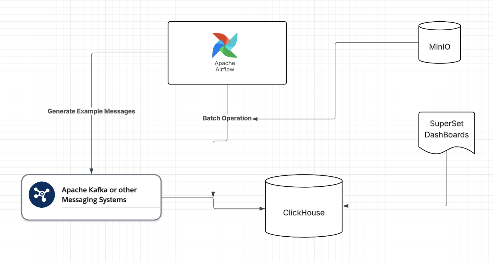
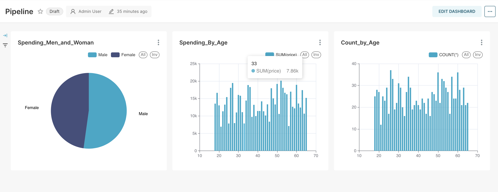
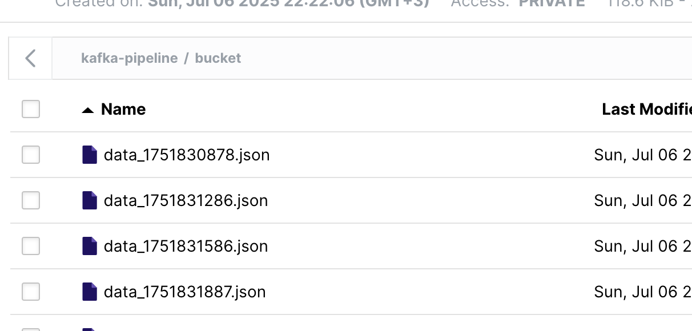

## Kafka + Airflow pipeline

This project is an example data pipeline.

Airflow Dag  [producer](./kafka_producer_dag.py) generates example data and sends it to a Kafka topic.  
ClickHouse DB is used to read data from the topic.  
Superset is used to visualize the data.  
Airflow Dag  [batch_load](./kafka_batch_load.py) creates bathes from topic and sends it to MinIO.  

